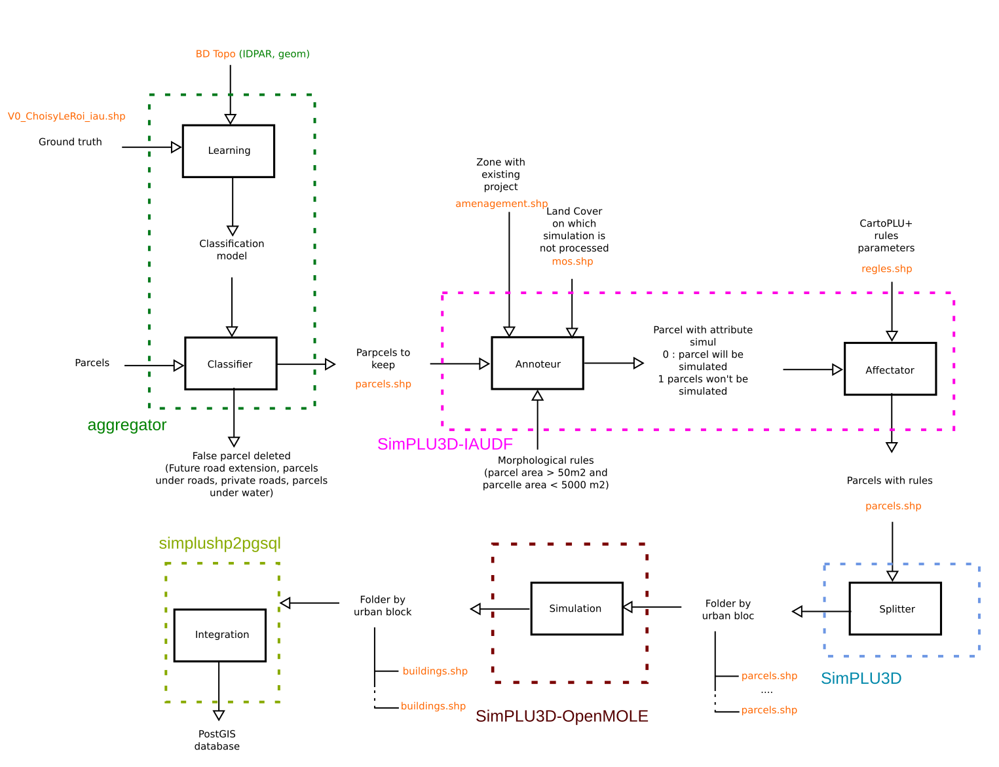

# Simplu3D-workflow

This project contains codes that allow the distribution of [SimPLU3D](https://simplu3d.github.io/) calculation on very large zone with calculation distribution thanks to [OpenMOLE project](https://github.com/openmole). Several scripts has been prepared to realize this workflow and the following documentation explains how to run them. Some of the steps are specially prepared for an experiment with specific data. Nevertheless, otherones are runnable on data with specifications simple to fulfill.

Some results of this work can be found on [this video](https://youtu.be/kLP-1g_uAVo?t=252) or this publication :
> Brasebin, M., P. Chapron, G. Chérel, M. Leclaire, I. Lokhat, J. Perret and R. Reuillon (2017) Apports des méthodes d’exploration et de distribution appliquées à la simulation des droits à bâtir, Actes du Colloque International de Géomatique et d'Analyse Spatiale (SAGEO 2017). [Article](https://mbrasebin.github.io/publications/2017-Sageo.pdf) , [Présentation](https://mbrasebin.github.io/presentations/2017-SAGEO.pdf)


#  The workflow

The following image presents the global workflow (you can click on it to get a full resolution image)

[](https://raw.githubusercontent.com/SimPLU3D/simplu3D-workflow/master/img/SchemaPretraitementSimPLU-IAU_en.png)

The workflow is composed of five majors steps :
- **Learning/Classifier** (aggregator box) : this algorithm aims at determining and deleting false parcels from geographic data and a ground truth ;
- **Annoteur/affectator** (SimPLU3D-IAIUDF box) : this steps 1/ determines which parcels have to be simulated from land cover and 2/ affect rules parameters to parcelles  
 - **Splitter** (SimPLU3D box) : this steps split parcels into in order to get package with a maximum quantity of simulable parcels
- **Simulation** (SimPLU3D-OpenMOLE box) : this step is the calculation distribution with the [OpenMOLE project](https://github.com/openmole).
- **Integration** (simplushp2pgsql) : Integration of calculation simulation into a PostGIS database.

# Getting the scripts

Different scripts are necessary to run this task, you will have :
* 1 - To download or clone the content of this repository ;
* 2 - To run *get_scripts.sh* that will download the scripts that are not hosted by this repository

# Learning/Classifier

This task aims at learning and detecting false parcels in a parcel shapefile. This script is available in the *aggregator* folder downloaded by *get_scripts.sh*.

To run it,  
```console
./aggregator-1.0/bin/aggregator /path/to/BD_Topo/ /path/to/Cadastre/to_simulate/ /path/to/ground_truth/ ./temp/ ./output_workflow/parcels.shp
```

where :
- */path/to/Cadastre/to_simulate/* is the path to a cadastral parcel shapefile. It can be downloaded by the DGFIP on the [ETALAB repositories](https://cadastre.data.gouv.fr/datasets/cadastre-etalab). This dataset determines the area on which the simulation will be processed ;
- */path/to/ground_truth/* the ground truth folder that is used to detect if a parcel is buildable or not (cf the image). It has a **buildable** attribute that can take 0 or 1 as value if the parcel is real or not. The area of the ground truth must be influed in the simulation zone and has to be nammed **parcelles.shp**  ;
- */path/to/BD_Topo/* : a set of topographic data that is produced by the French IGN. More information available on [the dedicated website](http://professionnels.ign.fr/bdtopo) ;
- *./temp/* : a temporary folder that will contain intermediary results ;
- *./output_workflow/parcels.shp* : the result of the process that can be used to the following task.

# Annoteur/affectator

This step aims at determining which parcels have to be simulated according to a land cover dataset and morphological indicators. It is realized with a PostGIS database. The scripts are in the *iauidf_prepare_parcels_for_zone_packer/* directory.

Step 1 : Creation of a PostGIS database.
Step 2 : Import of the data in PostGIS

This step is realized with the *create_parcelles_rules.sh* script that needs to be updated and notably :
- *information relative to PostGIS connexion*
- *parcelle_shape="parcels_94.shp"* : the parcel file path produced from the previous step ;
- *amenagement_shape="amenagement.shp"* : a database that contains project planification on which simulation won't be processed ;
- *mos_shape="mos.shp"* : a LAND Cover dataset produced by the IAUIDF on which simulation will not be processed ;
- *regles_shape="regles.shp"* : the rules parameters from CartoPLU+ database.
The script *parcelles_rulez.sql* will be applied once the database is imported.

The table *parcelles_rulez* has to be exported fo the following step.

# Splitter

The splitter step aims at creating set of data with a maximal number of parcels to simulate. The idea is to avoid to distribute zone with a large quantity of parcels.

The script is *SimPLU3D-openmole-release/zonepacker.sh* downloaded with the *get_scripts.sh* script.

```console
./zonepacker.sh "/path/to/parcels_rulez.shp" "/tmp/tmp/" "/tmp/out/" 20
```

where :
- */path/to/parcels_rulez.shp* : the shapefile produced in the previous step ;
- */tmp/tmp/* : an empty temporary folder ;
- */tmp/out/* : a folder that will contain a set of folders with an homogeneous set of simulable parcels ;
- *20* : the maximal number of parcels in a set.

# Simulation

This steps aims at distributing the calculation with OpenMole. The downloaded *SimPLU3D-openmole-release* folder contains all the necessary material to do this in the *openmole* folder :
-  **simplu3d-openmole-plugin_2.12-1.0.jar** : that can be imported as an OpenMOLE plugin ;
- **EPFIFTaskRunner.oms** : a script to distribute the calculation according to the folder tree contained in *dataBasicSimu* ;
- **scenario** : a folder that contains two sample of scenarios (a fast to test if the script is ok and a real one) ;
- **94** : a folder in which the data produced in the previsous step has to be pasted.

# Integration
This steps aims at integrating the simulation results into the database created in the Annoteteur/affectator step.

The script and the documentation are available in the *iauidf_results_to_db/*.

# Conditions for use
This software is free to use under CeCILL license. However, if you use this library in a research paper, you are kindly requested to acknowledge the use of this software.

Furthermore, we are interested in every feedbacks about this library if you find it useful, if you want to contribute or if you have some suggestions to improve it.

# Contact for feedbacks
[Mickaël Brasebin](https://mbrasebin.github.io/) & [Julien Perret](http://recherche.ign.fr/labos/cogit/cv.php?prenom=Julien&nom=Perret)
[COGIT Laboratory](http://recherche.ign.fr/labos/cogit/accueilCOGIT.php)
({surname.name} (AT) {gmail} (POINT) {com})

#  Acknowledgments


+ IAUIDF and DRIEA for supporting the project by providing advice to improve the quality of simulations and CartoPLU+ database.


# The general workflow
