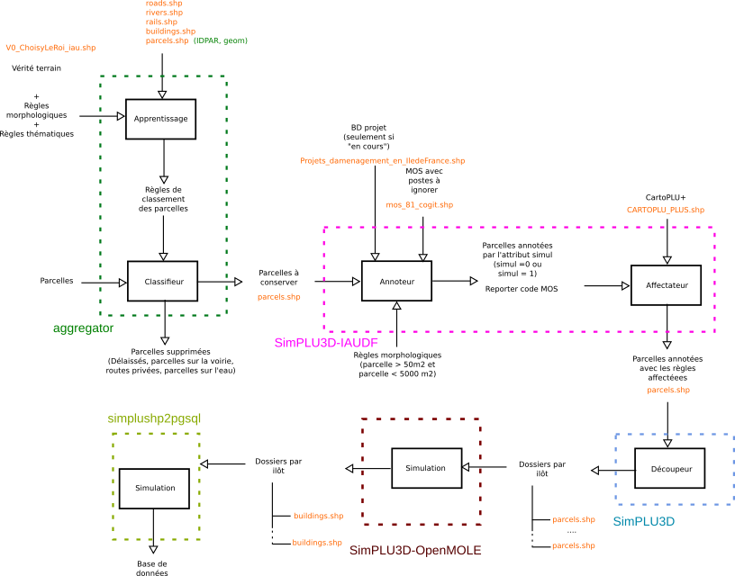

# Simplu3D-workflow

This project contains codes that allow the distribution of [SimPLU3D](https://simplu3d.github.io/) calculation on very large zone. Several scripts has been prepared to realize this workflow and the following documentation explains how to run them. Some of the steps are specially prepared for an experiment with specific data. Nevertheless, otherones are runnable on data with specifications simple to fulfill.

Some results of this work can be found on [this video](https://youtu.be/kLP-1g_uAVo?t=252) or this publication :
> Brasebin, M., P. Chapron, G. Chérel, M. Leclaire, I. Lokhat, J. Perret and R. Reuillon (2017) Apports des méthodes d’exploration et de distribution appliquées à la simulation des droits à bâtir, Actes du Colloque International de Géomatique et d'Analyse Spatiale (SAGEO 2017). [Article](https://mbrasebin.github.io/publications/2017-Sageo.pdf) , [Présentation](https://mbrasebin.github.io/presentations/2017-SAGEO.pdf)

#  The workflow

# Conditions for use
This software is free to use under CeCILL license. However, if you use this library in a research paper, you are kindly requested to acknowledge the use of this software.

Furthermore, we are interested in every feedbacks about this library if you find it useful, if you want to contribute or if you have some suggestions to improve it.

# Contact for feedbacks
[Mickaël Brasebin](https://mbrasebin.github.io/) & [Julien Perret](http://recherche.ign.fr/labos/cogit/cv.php?prenom=Julien&nom=Perret)
[COGIT Laboratory](http://recherche.ign.fr/labos/cogit/accueilCOGIT.php)
({surname.name} (AT) {gmail} (POINT) {com})

#  Acknowledgments

+ IAUIDF and DRIEA for supporting the project by providing advice to improve the quality of simulations and CartoPLU+ database.

# The general workflow
